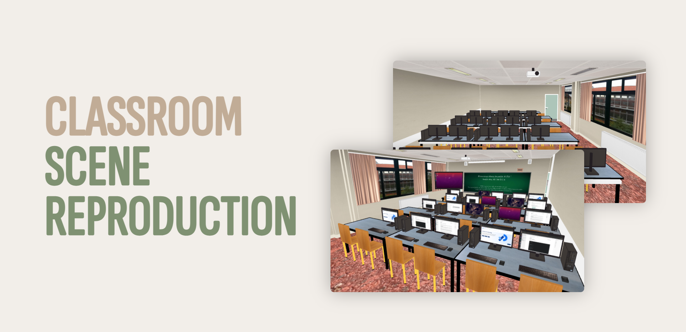

  <h1 align="center">Classroom scene reproduction</h2>
  
Reproduction of a classroom at the University of Le Havre Normandy in the form of a scene

  
  

  
  
  

  

### Prerequisites

We will use the Processing environment and programming language. Processing is an environment dedicated to graphic programming, artistic creation and everything related to the visual arts. It is both a basic development environment and a programming language. The latter is based on the Java language with some extensions.

Processing installs on all systems where Java can run. You can install it from the site [Processing](https://processing.org/). 

### About

### Code overview

### Preview of the result

### User guide